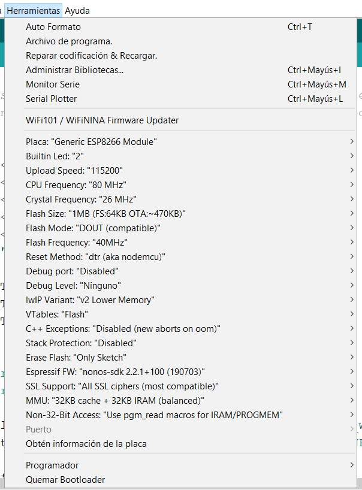

# Smart Open Park

## EcoWin

A temperature and humidity sensor board developed by Robolab. 

There are two versions. Both have an ESP8266 and a DHT22 sensor. 

### V.2017.09

This version has to be power externally by micro-USB or with the JP2 serial port (in th left).

The model of the ESP8266 is a ESP07. This is the pinout.

#### How to program

1. In the JP2 port you can connect an FTDI USB to serial.

The definition of the JP2 (in order up to down) is the following:
GND
GPIO0
VCC
GPIO3 (RXD 0)
GPIO1 (TXD 0)
GPIO16 (WAKE)

An example on connection with a FTDI is
**EcoWin | FTDI**
GND -> GND
GPIO0 -> CTS
VCC -> VCC
RXD 0 -> TX
TXD 0 -> RX
WAKE -> DTR

##### Arduino version

2. You need to install ESP8266 Boards library. 

3. Select "Generic ESP8266 Module" and copy this configuration.

4. To enter the programming mode in the ESP266 you need to press the followings buttons in the board:
    1. Hold "Program"
    2. Hold and release "Reset"
    3. Release "Program"

5. Press Upload program button in the ArduinoIDE.

##### PlatformIO version
// TODO

### V.2017.08
// TODO